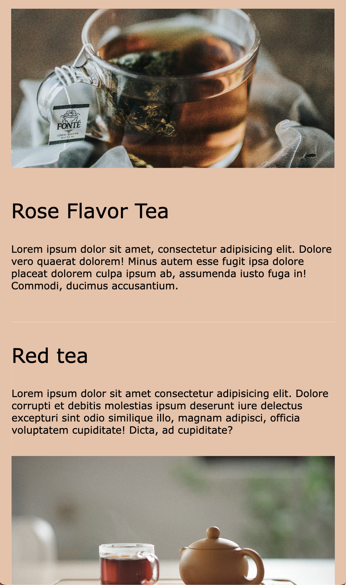

# Animation on Scroll and load

This is a quick project on how to make onScroll animation using Vanilla JS.

> Output

---

- When you scroll Down and each items appears it'll animate from left to right. ( only after it appears)
